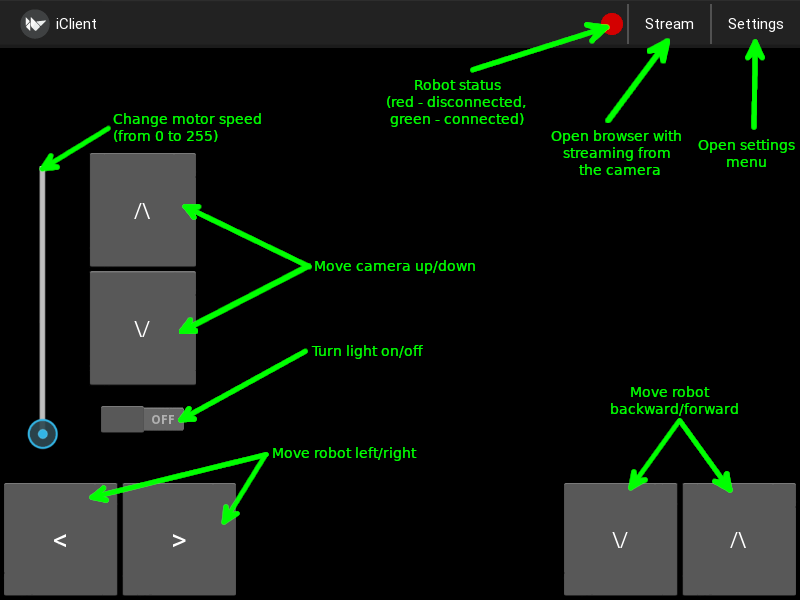

# iClient


### About
iClient is cross-platform client for Investigator-1, was written on Python3 (Kivy)


### Supported Operating Systems

- Linux
- Windows
- Mac OS
- Android


### Installation

###### Android

1. Download iClient APK from the [latest release](https://github.com/YariKartoshe4ka/Investigator-1/releases/latest))
2. Launch the APK and install iClient
3. Launch the program with a shortcut

###### Linux / Mac OS / Windows

Open terminal and run following commands

```sh
cd ~
wget https://github.com/YariKartoshe4ka/Investigator-1/archive/1.0.0.zip
unzip 1.0.0.zip
cd Investigator-1-1.0.0/client
pip3 install -r requirements.txt
python3 main.py
```


### Review




### Configuration

1. Press **Settings** button in action bar
2. Put ip of your Investigator-1 in **Host** option.
3. Close settings menu

If robot status became green, your configuration is good!
