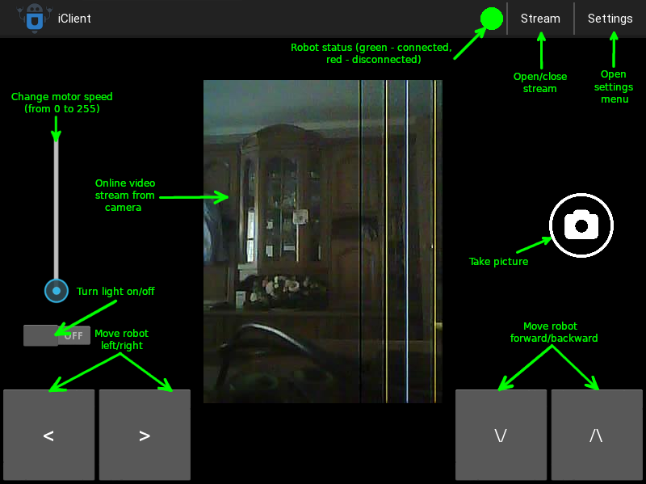

# iClient


### About
iClient is cross-platform client for Investigator-1, was written on Python3 (Kivy)


### Supported Operating Systems
- Linux
- Windows
- Mac OS
- Android


### Requirements (Linux / Mac OS)
- Python3
- Kivy (Python3 module)


### Installation

###### Windows / Android

1. Download iClient installer from thr [latest release](https://github.com/YariKartoshe4ka/Investigator-1/releases/latest) (for Windows, the file will end in __.exe__, for Android - __.apk__)
2. Launch the installer and install iClient
3. Launch the program with a shortcut

###### Linux / Mac OS

Open terminal and run following commands

```sh
cd ~
wget https://github.com/YariKartoshe4ka/Investigator-1/archive/1.0.0.zip
unzip 1.0.0.zip
cd Investigator-1-1.0.0/client
pip3 install -r requirements.txt
python3 main.py
```


### Review




### Configuration

The entire configuration will be determined by itself, if this does not happen, do the following:

1. Press **Settings** button in action bar
2. Put ip of your Investigator-1 in **Host** option.
3. Close settings menu
4. Turn on light. (If robot status will be green, your configuration is good)
