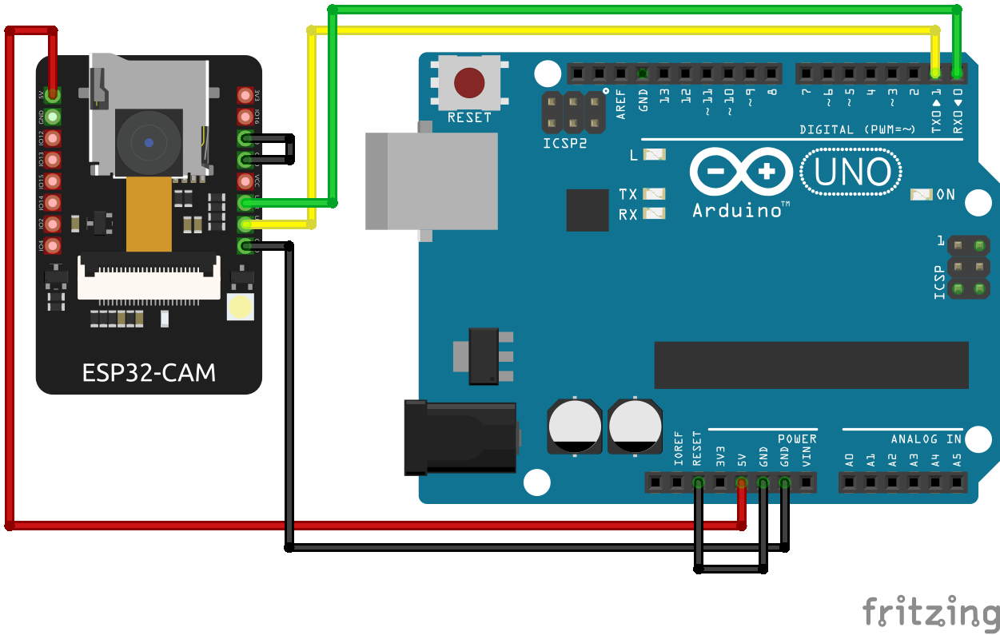

# Guide

1. [Preparing](#preparing)
    - [Getting components](#getting-components)
    - [Setup Arduino IDE](#arduino-ide)
        - [ESP32-CAM](#esp32-cam)
        - [Arduino Uno](#arduino-uno)
2. [Building](#building)
    - [Flashing ESP32-CAM](#flashing-esp32-cam)

# Preparing

### Getting components

I ordered all the components on AliExpress. This is full price-list of it:

- [Arduino Uno R3](components/arduino_uno_r3.jpg) \~4.5$
- [ESP32-CAM](components/esp32-cam.jpg) \~5$
- [Chassis](components/chassis.jpg) \~7$
- [Wires F-M 20sm](components/wires_f-m_20sm.jpg) \~1$
- [Wires M-M 20sm](components/wires_m-m_20sm.jpg) \~1$
- [L298N motor driver](components/l298n_motor_driver.jpg) \~1.5$
- [SG90](components/sg90.jpg) \~1.2$
- [BreadBoard mini](components/breadboard_mini.jpg) \~0.5$
- [18650 battery](components/18650_battery.jpg) \~2.5$ (if you have got small power bank, you can use it instead of this)
- [Case for 18650 battery](components/case_for_18650_battery.jpg) \~1$ (if you have got small power bank, you can use it instead of this)
- [Wire USB to DC 5.5mm](components/wire_usb_to_dc_5.5mm.jpg) \~0.8$ (you can use default [USB A to USB B wire](components/wire_usb_a_to_usb_b.jpg) =$0 (included in arduino uno), instead of this)
- [Leds](components/leds.jpg) \~1$
- [Toggle switch button](components/toggle_switch_button.jpg) =0$ (included in chassis)

Full price is: \~40.5$

### Setup Arduino IDE

###### ESP32-CAM

I found [easy guide](https://www.youtube.com/watch?v=0LIhTLsOLbA) how configure Arduino IDE for ESP32-CAM. Now you only need install ESP32-CAM library 

###### Arduino Uno

You only need to install the L298N library from [here](https://github.com/AndreaLombardo/L298N)

# Building

### Flashing ESP32-CAM

Open [this sketch](../../arduino/esp32-cam/esp32-cam.ino) and flash it with [previous guide](#esp32-cam) on youtube 
This is schema for flashing ESP32-CAM

