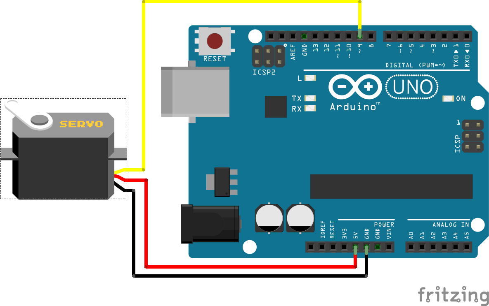
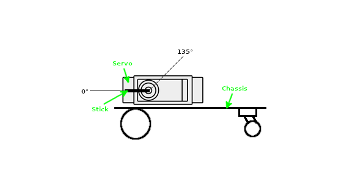

# Guide

1. [Preparing](#preparing)
    - [Getting components](#getting-components)
    - [Setup Arduino IDE](#arduino-ide)
        - [ESP32-CAM](#esp32-cam)
        - [Arduino Uno](#arduino-uno)
    - [Formatting MicroSD](#formatting-microsd)
2. [Building](#building)
    - [Flashing ESP32-CAM](#flashing-esp32-cam)
    - [Configuring servo](#configuring-servo)
    - [Building](#building-1)
    - [Flashing Arduino Uno](#flashing-arduino-uno)
3. [Managing](#managing)
    - [iClient](#iclient)


<hr>

# Preparing

### Getting components

I ordered all the components on AliExpress. This is full price-list of it:

- [Arduino Uno R3](components/arduino_uno_r3.jpg) \~4.5$
- [ESP32-CAM](components/esp32-cam.jpg) \~5$
- [Chassis](components/chassis.jpg) \~7$
- [Wires F-M 20sm](components/wires_f-m_20sm.jpg) \~1$
- [Wires M-M 20sm](components/wires_m-m_20sm.jpg) \~1$
- [L298N motor driver](components/l298n_motor_driver.jpg) \~1.5$
- [SG90](components/sg90.jpg) \~1.2$
- [BreadBoard mini](components/breadboard_mini.jpg) \~0.5$
- [18650 battery](components/18650_battery.jpg) \~2.5$ (if you have got small power bank, you can use it instead of this)
- [Case for 18650 battery](components/case_for_18650_battery.jpg) \~1$ (if you have got small power bank, you can use it instead of this)
- [Wire USB to DC 5.5mm](components/wire_usb_to_dc_5.5mm.jpg) \~0.8$ (you can use default [USB A to USB B wire](components/wire_usb_a_to_usb_b.jpg) =$0 (included in arduino uno), instead of this)
- [Leds](components/leds.jpg) \~1$
- [Toggle switch button](components/toggle_switch_button.jpg) =0$ (included in chassis)
- [MicroSD card](components/microsd_card.jpg) \~1$ (for convenience, also do not use a card with a large size, because this is only needed for containing WiFi configuration; if you don't want use microSD card, you can change the code)

Full price is: \~41.5$

### Setup Arduino IDE

###### ESP32-CAM

I found [easy guide](https://www.youtube.com/watch?v=0LIhTLsOLbA) how configure Arduino IDE for ESP32-CAM. Now you only need install ESP32-CAM library<br>

###### Arduino Uno

You only need to install the L298N library from [here](https://github.com/AndreaLombardo/L298N)


### Formatting MicroSD

If you use MicroSD card, you must format it with FAT32 file system. Create __wifi.conf__ file in root of file system and [write](../../arduino/esp32-cam/wifi.conf.examplew) to it credentials of your WiFi network. Then put MicroSD card into the ESP32-CAM<br>

If you don't use MicroSD card, change this strings in [sketch of ESP32-CAM](../../arduino/esp32-cam/esp32-cam.ino)

```cpp
...

  String* out[2] = {readWiFiConfig(SD_MMC, "/wifi.conf")};
  const char* ssid = out[0]->c_str();
  const char* password = out[1]->c_str();

...
```

to

```cpp
...

  const char* ssid = "SSID of your WiFi network";
  const char* password = "Password of your WiFi network";

...
```

**Plus**: no one will know the data from your WiFi<br>
**Con**: if you want to use the robot in another WiFi network, you will have to deconstruct the robot and flash the ESP32-CAM again with new WiFi credentials.

<hr>


# Building

### Flashing ESP32-CAM

Open [this sketch](../../arduino/esp32-cam/esp32-cam.ino) and load it with [previous guide](#esp32-cam) on youtube<br>
This is schema for flashing ESP32-CAM


### Configuring servo

Connect servo motor to Arduino Uno with this schema



and load [this sketch](../../arduino/servo/servo.ino). It will move servo to 0°. Then put servo on chassis with this schema

<center></center>


### Building

Now you can build robot with this schema


On the chassis, I arranged everything like this


### Flashing Arduino Uno


Open [this sketch](../../arduino/arduino-uno/arduino-uno.ino) and load it to Arduino Uno<br>
Now you need to make sure that WiFi network is working and restart the robot by turning on and off toggle switch button

<hr>


# Managing

### iClient

To control the robot you can install [iClient](../../client) (client for Investigator-1, was written by me too).
