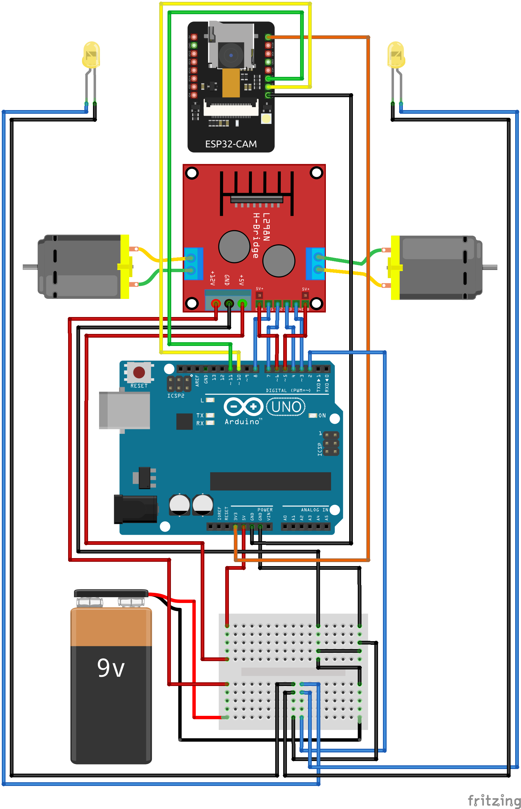

# Guide

1. [Preparing](#preparing)
    - [Getting components](#getting-components)
    - [Setup Arduino IDE](#arduino-ide)
        - [ESP32-CAM](#esp32-cam)
        - [Arduino Uno](#arduino-uno)
2. [Building](#building)
    - [Flashing ESP32-CAM](#flashing-esp32-cam)
    - [Building](#building-1)
    - [Flashing Arduino Uno](#flashing-arduino-uno)
3. [Managing](#managing)
    - [API](#api)
    - [iClient](#iclient)


# Preparing

### Getting components

I ordered all the components on AliExpress. This is full price-list of it:

- [Arduino Uno R3](components/arduino_uno_r3.jpg) \~4.5$
- [ESP32-CAM](components/esp32-cam.jpg) \~5$
- [Chassis](components/chassis.jpg) \~7$
- [Wires F-M 20sm](components/wires_f-m_20sm.jpg) \~1$
- [Wires M-M 20sm](components/wires_m-m_20sm.jpg) \~1$
- [L298N motor driver](components/l298n_motor_driver.jpg) \~1.5$
- [BreadBoard mini](components/breadboard_mini.jpg) \~0.5$
- [18650 battery](components/18650_battery.jpg) \~2.5$ (if you have got small power bank, you can use it instead of this)
- [Case for 18650 battery](components/case_for_18650_battery.jpg) \~1$ (if you have got small power bank, you can use it instead of this)
- [9v battery](components/9v_battery.jpg) \~5$
- [Leds](components/leds.jpg) \~1$
- [USB A to USB B wire](components/wire_usb_a_to_usb_b.jpg) =$0 (included in arduino uno)

Full price is: \~35$


### Setup Arduino IDE

###### ESP32-CAM

I found [easy guide](https://www.youtube.com/watch?v=0LIhTLsOLbA) how configure Arduino IDE for ESP32-CAM. Now you only need install ESP32-CAM library<br>

###### Arduino Uno

You only need to install the L298N library from [here](https://github.com/AndreaLombardo/L298N)


# Building

### Flashing ESP32-CAM

1. Open [this sketch](../../arduino/esp32-cam/esp32-cam.ino)
2. Replace `********` with SSID and password of your WiFi
```cpp
...

  const char* ssid = "*********";
  const char* password = "********";

...
```
3. Load it with [previous guide](#esp32-cam) on youtube<br>
This is schema for flashing ESP32-CAM


### Building

Now you can build robot with this schema




### Flashing Arduino Uno


Open [this sketch](../../arduino/arduino-uno/arduino-uno.ino) and load it to Arduino Uno<br>
Now you need to make sure that WiFi network is working and restart the robot by turning on and off Arduino Uno


# Managing

### API

Robot is managed by sending HTTP GET requests to [http://Investigator-1/api](http://Investigator-1/api) url. The message is passed in the cmd parameter. It has this structure: _HEADER_ → _COMMAND\_1_ ... _COMMAND\_N_ → _FOOTER_  i.e. the final url will look like this: [http://Investigator-1/api?cmd=light off](http://Investigator-1/api?cmd=%01%02%FF). The request is processed by ESP32-CAM and sent to the Arduino Uno via Serial. Arduino, in turn, processes the command by simple if-else comparisons and executes it. A table of all commands by default:

| Byte | Name                    | Command                              |
|------|-------------------------|--------------------------------------|
| 0x01 | MESSAGE_HEADER          | Signals the start of a new message   |
| 0x02 | COMMAND_LIGHT_ON        | Turns light on                       |
| 0x03 | COMMAND_LIGHT_OFF       | Turns light off                      |
| 0x04 | COMMAND_DIRECTION_STOP  | Signals to the car to go straight    |
| 0x05 | COMMAND_DIRECTION_LEFT  | Signals to the car to turn left      |
| 0x06 | COMMAND_DIRECTION_RIGHT | Signals to the car to turn right     |
| 0x07 | COMMAND_RUN_STOP        | Signals to the car to stop           |
| 0x08 | COMMAND_RUN_FORWARD     | Sginals to the car to go forward     |
| 0x09 | COMMAND_RUN_BACKWARD    | Sginals to the car to go backward    |
| 0x0A | COMMAND_SPEED_LOW       | Sets the speed to minimum value (0)  |
| 0x0B | COMMAND_SPEED_MEDIUM    | Sets the speed to medium value (127) |
| 0x0C | COMMAND_SPEED_HIGH      | Sets the speed to medium value (255) |
| 0x0D | COMMAND_SPEED_DEC       | Decreases the speed by one           |
| 0x0E | COMMAND_SPEED_INC       | Increases the speed by one           |
| 0xFF | MESSAGE_FOOTER          | Signals the end of a message         |

### iClient

To easy control the robot you can install [iClient](../../client) (wrapper for Investigator-1 commands API, was written by me too).

